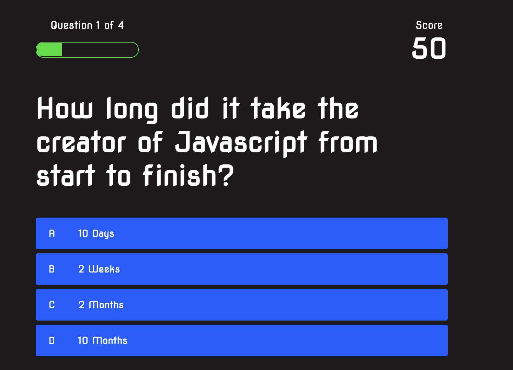

# Description - JavaScript Quiz - Built with JavaScript

This is an application utilizing Javascript to randomly create a quiz with four separate html pages. There is a starting page where you can check the high scores or start the game, then as you pass through the game, your time remaining is set as your high score, which you can save into the new high scores list.

Included in this application are:
* Manipulating the DOM to hide and reveal different questions and answers randomly
    * adding the "correct" and "incorrect" data class to each of the selections
    * using event delegation to figure out which option has been clicked and then parsing each answer to figure out which answer is correct

* High Scores Page
    * using local storage to save the last score and the name and then Getting local storage to display the top 5 high scores

Challenges I encountered
* formatting was a big challenge, makeing sure all my elements appeared at the right time and the right spot was something that was very challenging
*Starting the game felt easy, but ending the game was more challenging. the way I solved it was creating a variable that set the amount of questions remaining to the # question that the user was currently answering. When that was set to 0, the game would end and immediately go to the end.html; also the end timeout section was had a part of the function that would take the user to the end.html when the timer made it to " <= 0 "

## Credits
Many thanks to the below individuals who provided input, suggestions, or played a "rubber ducky" role
* Chris Martinez
* Mim Armand
* Kat Poulos

Sources used for significant help:
I used one blog post and two youtube videos for significant help in the process

* [Web Dev Simplified](https://www.youtube.com/watch?v=riDzcEQbX6k)
* [Brian Design](https://www.youtube.com/watch?v=f4fB9Xg2JEY)
* [SitePoint - Build a Javascript Quiz](https://www.sitepoint.com/simple-javascript-quiz/)

If any additional issues are found, or if there are any suggestions for improvement, please send an email to site developer Jay Yousef at jay.yousef@gmail.com

---

## <ins>Installation</ins>
1.  Clone or download .zip file from Github to your local computer
2.  Open index.html via your preferred browser or code/text editor

### <ins>Cloning</ins>
1. From Github, select the "Code" button, choose either HTTPS or SSH as appropriate
2. Click the copy button  to add it to your clipboard
3. In your preferred command line (terminal, bash, etc), navigate to the folder you'd like to download the repository into
4. Type `git clone [pasted url from clipboard]` and press enter
5. Access the content with your code editor by either typing `code .` in your command line or by using your editor's `File > Open Folder` in your code editor menu. If only viewing in a browser, simply double click index.html to open in your default browser

### <ins>Zip file</ins>
1. From Github, select the "Code" button, then select "Download ZIP"
2. Choose which folder to download the repository into via the dialog box that appears
3. After downloading, open the .zip file and select "Extract All" from the top of the window that appears
4. Access the content with your code editor by selecting `File > Open Folder` in your code editor menu. If only viewing in a browser, simply double click index.html to open in your default browser

[Link to Live Javascript Quiz Application](https://jayyousef.github.io/javascript_quiz_ultimate_champion/)

---

These updates are covered under [GNU General Public License v3.0](./assets/GNU_Public_License)

## Screenshot below:

